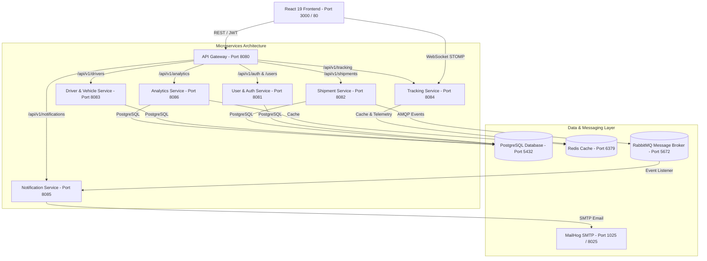

# 🚚 ShipTrack Pro — Enterprise Logistics & Real-Time Tracking Platform

> **ShipTrack Pro** is a modern, cloud-native enterprise shipment tracking, fleet telemetry, and logistics management platform built with Spring Boot microservices, Spring Cloud Gateway, Redis, RabbitMQ, PostgreSQL, React 19, Google Maps API, and WebSocket STOMP real-time streaming.

---

## 📐 System Architecture



---

## 🛠️ Technology Stack Summary

| Layer | Technologies |
|-------|--------------|
| **Backend Core** | Java 21, Spring Boot 3.x, Spring Cloud Gateway, Spring Security, Spring Data JPA |
| **Databases & Cache** | PostgreSQL 16 (Schema-per-service isolation), Redis 7 (TTL 5-min analytics & telemetry cache) |
| **Messaging & Mail** | RabbitMQ 3 (AMQP async event routing), MailHog SMTP (Email testing) |
| **Frontend UI** | React 19, React Router v7, Tailwind CSS v4, Glassmorphic Design System, `react-hot-toast` |
| **Data Viz & Maps** | Chart.js (`react-chartjs-2`), Google Maps JavaScript API with SVG canvas fallback engine |
| **Real-Time Streaming** | WebSocket STOMP protocol over native WebSocket connection |
| **Containerization & CI/CD** | Docker multi-stage builds, Docker Compose, Kubernetes manifests, GitHub Actions |

---

## 🔌 Microservices & Port Registry

| Microservice | Port | Database / Cache | Responsibility |
|--------------|------|------------------|----------------|
| **API Gateway** | `8080` | N/A | Central REST routing, JWT authentication filter, CORS handler |
| **User Service** | `8081` | PostgreSQL (`shiptrack_user`) | User registration, authentication, JWT tokens, RBAC roles |
| **Shipment Service** | `8082` | PostgreSQL (`shiptrack_shipment`) | Shipment CRUD, status history, driver assignment, Proof of Delivery (POD) |
| **Driver Service** | `8083` | PostgreSQL (`shiptrack_driver`) | Driver roster, vehicle fleet management, duty status |
| **Tracking Service** | `8084` | Redis (Port 6379) | Live GPS telemetry pings, STOMP WebSocket broker (`/ws`) |
| **Notification Service** | `8085` | RabbitMQ (Port 5672) | Async event processing, email dispatch via SMTP |
| **Analytics Service** | `8086` | PostgreSQL (`shiptrack_analytics`) & Redis | Platform KPIs, volume series charts, PDF/CSV report exports |
| **React Frontend** | `3000` / `80` | N/A | Glassmorphic React SPA web application |

---

## ⚡ Quickstart Setup Guide

### 1. Prerequisites
- **Docker Desktop** installed and running.
- **Node.js 20+** (if running frontend standalone).
- **Java 21 JDK** & **Maven 3.9+** (if running backend standalone).

### 2. Launch Entire Platform via Docker Compose
```bash
# Clone repository
git clone https://github.com/shiptrack-pro/shiptrack-pro.git
cd shiptrack-pro

# Launch full microservices & infrastructure stack
docker-compose up -d --build
```

Access the application in your browser:
* 🌐 **React Web App**: `http://localhost:3000` (or `http://localhost:80`)
* 🔌 **API Gateway**: `http://localhost:8080`
* 📊 **RabbitMQ Management**: `http://localhost:15672` (User: `guest`, Pass: `guest`)
* ✉️ **MailHog Email Inbox**: `http://localhost:8025`

---

## 🔑 Seed User Credentials

| Role | Email | Password | Access Rights |
|------|-------|----------|---------------|
| **Customer** | `customer@shiptrack.com` | `password123` | Book shipments, track package live map, view POD receipts |
| **Admin** | `admin@shiptrack.com` | `admin123` | Global shipments control, driver assignment, analytics dashboard, fleet telemetry |

---

## 🚀 Deployment Options

### Docker Compose Mode
```bash
./deploy.sh docker
```

### Kubernetes (k8s) Production Deployment
```bash
./deploy.sh k8s
```

---

## 📄 License & Project Status

* **Status**: ✅ **100% COMPLETE** (All 25 Roadmap Steps Implemented & Verified)
* **License**: MIT License
